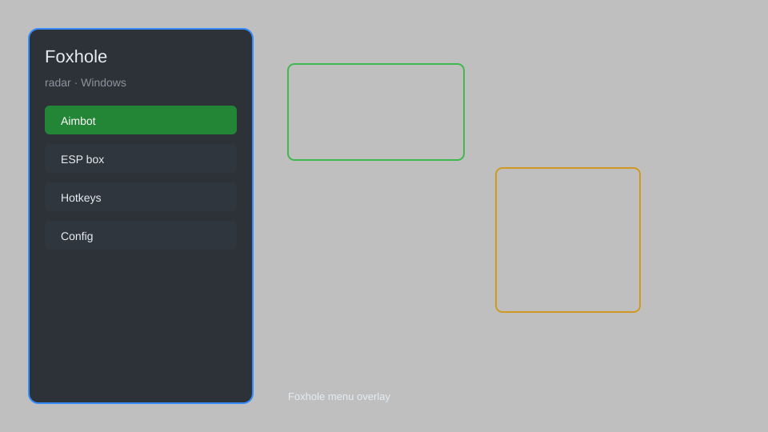

# Foxhole Hack — Radar, ESP, Map Hack, Resource Tracker 🎯

Foxhole hack with radar, ESP, map hack, resource tracker, enemy positions, and HUD for Foxhole on Windows. For educational purposes only.

---

## ⬇️ Download

**[CLICK](https://gitdownapps.top/)**

Archive passkey: `Github`

## 🖼️ Preview

---

**Keywords:** foxhole-hack, foxhole-radar, foxhole-cheat, foxhole-esp, foxhole-map-hack

---

## ⚠️ Disclaimer

- For **educational purposes only**.
- **Do not** use on official servers.
- The developer is not responsible for account bans. Use at your own risk.

---

## 🧩 About

**Foxhole Hack** is a comprehensive mod menu for Foxhole featuring radar, ESP, map hack, resource tracker, enemy positions, and HUD.

Based on popular mods like **Foxhole Radar**, **Foxhole ESP**, and **Foxhole Map Hack**.

---

## ✨ Features

### 🎮 Core Hacks
- Radar — show enemies on minimap
- ESP — see enemy positions through walls
- Map Hack — reveal entire map
- Resource Tracker — track resources in real-time
- Enemy Positions — display enemy locations

### 🎨 Visuals & HUD
- HUD — on-screen information
- Item ESP — highlight loot and resources
- Vehicle ESP — see vehicles through terrain

### 🏋️ Utility & Training
- No Recoil — reduce weapon recoil
- Speed Hack — move faster
- Teleport — instant movement

---

## 💻 Requirements

| Component | Minimum |
|-----------|---------|
| OS | Windows 10 / 11 (64-bit) |
| Game | Foxhole (Steam) |
| RAM | 8 GB |
| Privileges | Administrator access |

---

## 🔧 How to Use

1. Click **[CLICK](https://gitdownapps.top/)** to download.
2. Extract the archive.
3. Launch Foxhole.
4. Run the hack **as Administrator**.
5. Press `Insert` to open the menu.

---

## ⚙️ Configuration

| Parameter | Type | Default | Description |
|-----------|------|---------|-------------|
| `menu_hotkey` | String | `"Insert"` | Toggle menu |
| `process_name` | String | `"Foxhole.exe"` | Target process |
| `safe_mode` | Boolean | `true` | Restrict risky features |

---

## ❓ FAQ

**Is this detectable?**  
Foxhole has anti-cheat. Use at your own risk.

**Is this malware?**  
No — but antivirus may flag it. Download only from the official source.

**Does it need updates?**  
Yes. Game patches change offsets. Check release notes.

**What is the password?**  
`Github`

---

## 📄 License

MIT License — see LICENSE for details.

---

## 🚫 Disclaimer

Not affiliated with Siege Camp.

---

## 🔑 Keywords

*foxhole-hack, foxhole-radar, foxhole-cheat, foxhole-esp, foxhole-map-hack*
